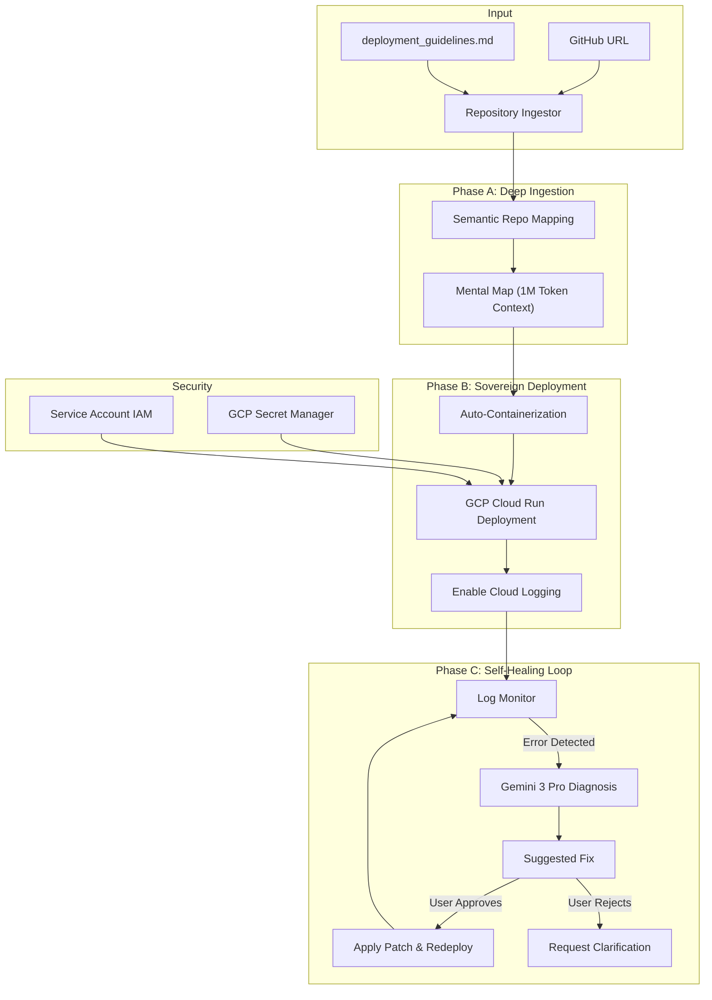
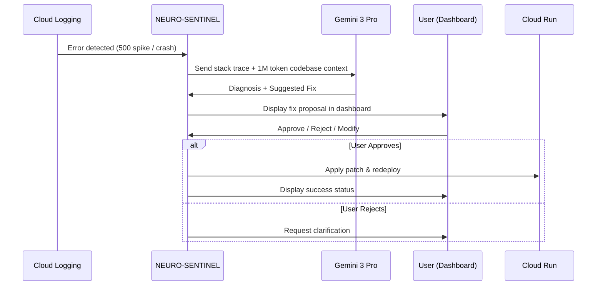

# NEURO-SENTINEL: Sovereign DevOps Agent

> **Zero-Touch Infrastructure Management** — Transform raw code into self-healing production environments using Gemini 3 Pro's 1M token reasoning.

---

## 1. Executive Summary

**NEURO-SENTINEL** is an autonomous deployment and operations agent that takes a **GitHub URL** and a **`deployment_guidelines.md`** file, then autonomously handles:

- 🐳 **Auto-Containerization** (Dockerfile generation)
- ☁️ **GCP Cloud Run Deployment** (Infrastructure as Code)
- 🔍 **Real-Time Incident Detection** (Log monitoring)
- 🩺 **Suggested Fixes** (Human-in-the-loop code surgery)

Unlike passive CI/CD pipelines, NEURO-SENTINEL acts as a **"Sovereign Surgeon"** that diagnoses production crashes by reasoning through the entire codebase context, then **proposes fixes for human approval** before applying them.

---

## 2. Architecture Overview



---

## 3. The "Sovereign Pipeline" — Phase Details

### Phase A: Deep Ingestion

| Step | Description |
|------|-------------|
| **Repository Clone** | Clone the target GitHub repo to a temporary workspace |
| **Semantic Mapping** | Using Gemini's 1M token window, build a "Mental Map" including dependency trees, entry points, and environment requirements |
| **Guidelines Parsing** | Parse `deployment_guidelines.md` to extract user constraints (e.g., "Port 8080", "PostgreSQL required", "Must use Redis cache") |

**Output:** `RepoMap` schema containing:
- `project_name`, `primary_language`, `entry_point`
- `dependency_file`, `detected_framework`
- `logic_flow`: Key modules and their responsibilities

---

### Phase B: Sovereign Deployment (GCP-Focused)

| Component | Implementation |
|-----------|----------------|
| **Auto-Containerization** | Generate optimized `Dockerfile` with multi-stage builds based on detected language/framework |
| **Cloud Run Deployment** | Generate and apply Terraform configuration for GCP Cloud Run with autoscaling |
| **Secrets Management** | Detect required environment variables, prompt user to store in **GCP Secret Manager**, inject at runtime |
| **Observability** | Enable **Cloud Logging** and **Cloud Monitoring** with structured log export |

#### GCP Services Used

| Service | Purpose |
|---------|---------|
| **Cloud Run** | Serverless container hosting with autoscaling |
| **Artifact Registry** | Docker image storage |
| **Secret Manager** | Secure secrets injection |
| **Cloud Logging** | Centralized log aggregation |
| **Cloud Monitoring** | Alerting and metrics |
| **IAM** | Service account with least-privilege access |

---

### Phase C: The Self-Healing Loop (Human-in-the-Loop)

> [!IMPORTANT]
> **NEURO-SENTINEL does NOT autonomously patch code.** All fixes are proposed to the user for review and approval before application.



#### Fix Proposal Format

When an error is detected, NEURO-SENTINEL presents a fix proposal in the following format:

```
╔══════════════════════════════════════════════════════════════╗
║  🩺 NEURO-SENTINEL FIX PROPOSAL                              ║
╠══════════════════════════════════════════════════════════════╣
║  ERROR: TypeError in core/api.py:142                         ║
║  DIAGNOSIS: Missing null check on user_id parameter          ║
║                                                              ║
║  SUGGESTED FIX:                                              ║
║  ┌──────────────────────────────────────────────────────────┐║
║  │ - def get_user(user_id):                                 │║
║  │ + def get_user(user_id: Optional[str] = None):           │║
║  │ +     if not user_id:                                    │║
║  │ +         raise ValueError("user_id is required")        │║
║  │      return db.users.find_one({"_id": user_id})          │║
║  └──────────────────────────────────────────────────────────┘║
║                                                              ║
║  CONFIDENCE: High (92%)                                      ║
║  RISK LEVEL: Low                                             ║
║                                                              ║
║  [✓ APPROVE]    [✗ REJECT]    [✎ MODIFY]                    ║
╚══════════════════════════════════════════════════════════════╝
```

---

### Assist Mode (Intern-Friendly Toggle)

> [!TIP]
> **Assist Mode** makes NEURO-SENTINEL accessible to junior developers and interns by explaining every action before execution.

When **Assist Mode** is enabled via the dashboard toggle, every fix proposal and deployment action includes:

| Component | Description |
|-----------|-------------|
| **What This Does** | Plain-English explanation of the action |
| **Why It's Needed** | Context from the codebase analysis |
| **Potential Implications** | Side effects, risks, and what could go wrong |
| **Learn More** | Links to relevant documentation |

#### Example: Assist Mode Fix Proposal

```
╔══════════════════════════════════════════════════════════════════════╗
║  🩺 NEURO-SENTINEL FIX PROPOSAL                      [🎓 ASSIST MODE] ║
╠══════════════════════════════════════════════════════════════════════╣
║  ERROR: TypeError in core/api.py:142                                 ║
║                                                                      ║
║  SUGGESTED FIX:                                                      ║
║  ┌──────────────────────────────────────────────────────────────────┐║
║  │ - def get_user(user_id):                                         │║
║  │ + def get_user(user_id: Optional[str] = None):                   │║
║  │ +     if not user_id:                                            │║
║  │ +         raise ValueError("user_id is required")                │║
║  └──────────────────────────────────────────────────────────────────┘║
║                                                                      ║
║  ┌─ 📖 WHAT THIS DOES ───────────────────────────────────────────────┐║
║  │ Adds a null-check to prevent the function from crashing when     │║
║  │ called without a user_id. The Optional[str] type hint tells      │║
║  │ Python (and your IDE) that this parameter can be None.           │║
║  └───────────────────────────────────────────────────────────────────┘║
║                                                                      ║
║  ┌─ 🎯 WHY IT'S NEEDED ──────────────────────────────────────────────┐║
║  │ The crash log shows get_user() was called from auth.py:89        │║
║  │ during a session timeout, where user_id becomes undefined.       │║
║  │ This fix handles that edge case gracefully.                      │║
║  └───────────────────────────────────────────────────────────────────┘║
║                                                                      ║
║  ┌─ ⚠️  POTENTIAL IMPLICATIONS ───────────────────────────────────────┐║
║  │ • Callers that relied on silent failure will now get an error    │║
║  │ • You may need to add try/catch in auth.py:89 to handle this     │║
║  │ • No database changes — this is code-only                        │║
║  │ • Risk Level: LOW — isolated change, easy to rollback            │║
║  └───────────────────────────────────────────────────────────────────┘║
║                                                                      ║
║  📚 Learn More: https://docs.python.org/3/library/typing.html       ║
║                                                                      ║
║  [✓ APPROVE]    [✗ REJECT]    [✎ MODIFY]                            ║
╚══════════════════════════════════════════════════════════════════════╝
```

#### Assist Mode for Deployment Actions

During deployment, Assist Mode explains each step:

```
┌─────────────────────────────────────────────────────────────────────┐
│ ▶ STEP 3/7: Pushing Docker image to Artifact Registry              │
├─────────────────────────────────────────────────────────────────────┤
│ 📖 WHAT THIS DOES                                                   │
│ Uploads your containerized app to Google's private image storage   │
│ so Cloud Run can pull and run it.                                  │
│                                                                     │
│ ⚠️  IMPLICATIONS                                                    │
│ • Your code is now stored in GCP (encrypted at rest)               │
│ • Billing: ~$0.10/GB/month storage cost                            │
│ • This image will be tagged as "latest" and overwrite previous     │
│                                                                     │
│ ⏱️  Estimated time: 30-60 seconds                                   │
└─────────────────────────────────────────────────────────────────────┘
```

---

## 4. Security Architecture

> [!CAUTION]
> Security is critical when an agent has access to cloud credentials and production code.

### 4.1 Secrets Management

| Mechanism | Implementation |
|-----------|----------------|
| **No Hardcoded Secrets** | All secrets stored in GCP Secret Manager |
| **Runtime Injection** | Secrets injected via Cloud Run secret mounts |
| **User Prompts** | Missing secrets detected during ingestion; user prompted to provide them |

### 4.2 Least-Privilege IAM

The NEURO-SENTINEL service account has **minimal permissions**:

```hcl
# Terraform IAM configuration
resource "google_project_iam_member" "sentinel_roles" {
  for_each = toset([
    "roles/run.admin",           # Deploy to Cloud Run
    "roles/artifactregistry.writer",  # Push images
    "roles/secretmanager.secretAccessor",  # Read secrets
    "roles/logging.viewer",      # Read logs (NOT admin)
  ])
  role   = each.value
  member = "serviceAccount:${google_service_account.sentinel.email}"
}
```

### 4.3 Guardrails — What NEURO-SENTINEL **Cannot** Do

| Prohibited Action | Enforcement |
|-------------------|-------------|
| Delete production resources | No `*.delete` IAM roles |
| Access billing/IAM settings | No `resourcemanager.*` roles |
| Modify secrets | Only `secretAccessor`, not `secretAdmin` |
| Push to `main` branch | Protected branch rules on GitHub |
| Apply fixes without approval | Human-in-the-loop requirement |

### 4.4 Audit Trail

All actions are logged to Cloud Logging with the following structure:

```json
{
  "timestamp": "2026-01-14T12:00:00Z",
  "agent": "NEURO-SENTINEL",
  "action": "FIX_PROPOSED",
  "target_file": "core/api.py",
  "line_range": "142-145",
  "user_decision": "APPROVED",
  "deployment_id": "run-abc123"
}
```

---

## 5. Key Technical Features

| Feature | Hackathon "Wow Factor" | Technical Implementation |
|---------|------------------------|--------------------------|
| **1M Token Reasoning** | Can "see" the entire project at once | Gemini 3 Pro with `thinking_level="high"` |
| **Thought Signatures** | Prevents "Logic Drift" in multi-step fixes | Stateful tool-use with signature verification |
| **Human-in-the-Loop** | Safe, trustworthy automation | Fix proposals require user approval |
| **Assist Mode** | Intern-friendly educational toggle | Each action shows explanations, implications, and learn-more links |
| **3D Logic Lattice** | Visual "DevOps Command Center" | Next.js 14 + Three.js real-time visualization |
| **GCP Native** | Production-grade infrastructure | Cloud Run + Secret Manager + Cloud Logging |

---

## 6. Success Metrics

| Metric | Target | Measurement |
|--------|--------|-------------|
| **MTTR (Mean Time to Resolution)** | < 5 minutes (vs. 45 min human avg) | Time from error detection to approved fix deployment |
| **Deployment Success Rate** | 95% first-time success | Percentage of repos deployed without manual intervention |
| **Fix Proposal Accuracy** | > 85% approval rate | User acceptance rate of suggested fixes |
| **Security Incidents** | 0 unauthorized actions | Audit log review |

---

## 7. Demo Script

### Step 1: The Input
Paste a broken GitHub repo URL into the NEURO-SENTINEL dashboard.

### Step 2: The Analysis
Observe the 3D Lattice building in real-time. The **Thought Stream** displays:
```
◆ Detected Node.js 18 application
◆ Missing Dockerfile — generating with multi-stage build...
◆ Matching port to user guidelines (Port 4000)
◆ Detected PostgreSQL dependency — checking for secrets...
▶ Generating Cloud Run Terraform configuration...
```

### Step 3: The Deployment
Application deploys to Cloud Run. The Lattice shows all nodes turning **green (healthy)**.

### Step 4: The Crash
Simulate an error — the app crashes because a database connection string is missing.
- The Lattice nodes pulse **red**.
- Thought Stream shows: `✕ Error: ECONNREFUSED - database connection failed`

### Step 5: The Surgery (Human-in-the-Loop)
NEURO-SENTINEL:
1. Captures the stack trace
2. Cross-references with the 1M token codebase context
3. Identifies the missing `DATABASE_URL` environment variable
4. **Proposes a fix to the user:**

```
🩺 SUGGESTED FIX: Add DATABASE_URL to Secret Manager

The codebase references process.env.DATABASE_URL in db/connection.js:12
but this secret is not configured.

[APPROVE] - I'll create the secret and redeploy
[REJECT]  - I want to handle this differently
```

### Step 6: The Result
User approves. NEURO-SENTINEL:
- Creates the secret in GCP Secret Manager
- Mounts it to the Cloud Run service
- Redeploys

**Result:** A live, healthy production URL.

---

## 8. Tech Stack

| Layer | Technology |
|-------|------------|
| **Backend** | Python 3.12 + FastAPI |
| **AI Engine** | Gemini 3 Pro (1M token context) |
| **Frontend** | Next.js 14 + TypeScript + Three.js |
| **Real-Time** | Socket.IO |
| **Infrastructure** | Terraform + GCP (Cloud Run, Secret Manager, Logging) |
| **Containerization** | Docker + Artifact Registry |

---

## 9. Project Structure

```
NEURO-SENTINEL/
├── main.py                    # FastAPI entrypoint
├── core/
│   ├── ingestor.py            # Repository ingestion & context building
│   ├── deployment_logic.py    # SovereignSurgeon Gemini integration
│   └── schema.py              # Pydantic models (RepoMap, ThoughtSignature, DeploymentPlan)
├── frontend/
│   ├── src/
│   │   ├── app/
│   │   │   └── page.tsx       # Main dashboard
│   │   ├── components/
│   │   │   ├── Lattice.tsx    # 3D Logic Lattice (Three.js)
│   │   │   ├── ThoughtStream.tsx  # Real-time thought display
│   │   │   └── StatusCard.tsx # Status indicators
│   │   ├── lib/
│   │   │   └── socket.ts      # Socket.IO client
│   │   └── types/
│   │       └── index.ts       # TypeScript types
│   └── package.json
└── terraform/                 # GCP infrastructure (to be added)
    ├── main.tf
    ├── cloud_run.tf
    └── secrets.tf
```

---

## 10. Next Steps

- [ ] Implement full repo clone functionality in `ingestor.py`
- [ ] Add GCP Terraform templates (`terraform/`)
- [ ] Implement Cloud Logging integration for error detection
- [ ] Add fix proposal UI component to frontend
- [ ] Implement Socket.IO backend for real-time thought streaming
- [ ] Add authentication for dashboard access

---

> **Built for the Google DeepMind x Devpost Hackathon 2026**
> 
> Leveraging Gemini 3 Pro's 1M token context window to create the first "Sovereign Agent" that manages the entire DevOps lifecycle from a single URL.
